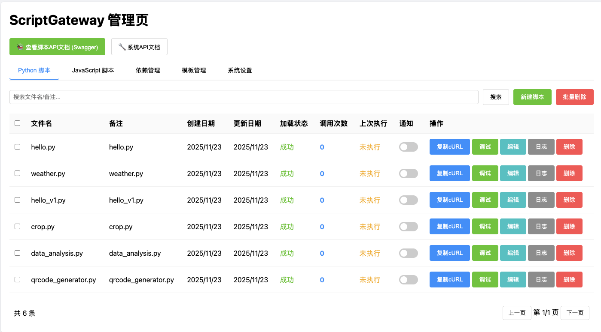
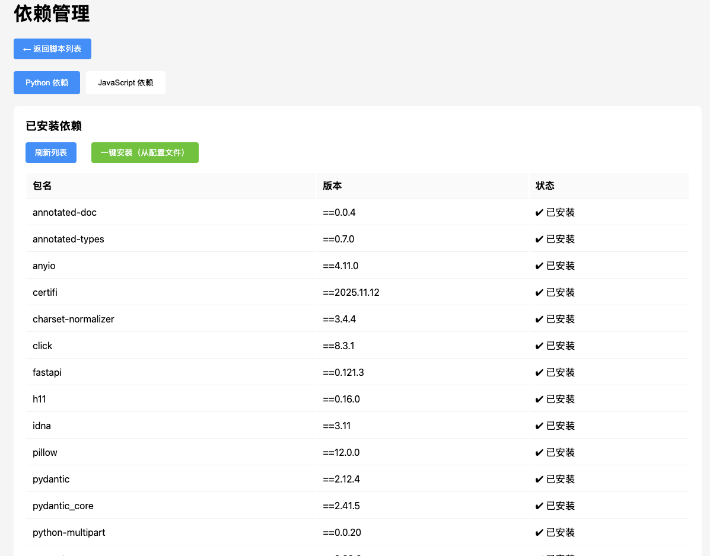

# ScriptGateway

English | [简体中文](./README.md)

## 📖 Introduction

ScriptGateway is a lightweight script hosting and API gateway platform designed to work seamlessly with workflow automation tools like n8n and Zapier. It quickly converts Python and JavaScript scripts into RESTful API endpoints through Docker containerization, solving the dependency management challenges of n8n's built-in code nodes.

### 🎯 Core Value

- **Solve Dependency Issues**: n8n's built-in script nodes cannot install third-party dependencies; ScriptGateway provides an independent dependency management environment
- **Quick API Exposure**: Scripts are automatically registered as HTTP interfaces without writing routing code
- **Web Scraping Integration**: Built-in Playwright/Puppeteer support for easy data collection capabilities in n8n
- **Visual Management**: Web interface for managing scripts, dependencies, and logs with convenient debugging

---

## ✨ Key Features

### 🚀 Automated Script Registration
- 📁 Auto-scan `scripts_repo/` directory to convert Python/JS scripts into APIs
- 🔄 Auto-reload on file changes
- 📝 Auto-generate Swagger API documentation from script comments
- 🎨 Support file uploads, JSON parameters, GET/POST requests

### 📦 Dependency Management
- 🐍 Python Dependencies: Install pip packages via web interface
- 📦 Node.js Dependencies: Install npm packages via web interface
- 🔍 Dependency conflict detection and resolution
- 💾 Persist dependency configurations to `requirements.txt` / `package.json`

### 🎛️ Web Management Interface
- 📊 Script List: View script status, call count, execution history
- 🐞 Online Debugging: Debug scripts with web forms and view real-time output
- 📝 Script Editor: Edit script code online
- 📜 Log Viewer: View script execution logs and history
- 🔔 Notification Config: Webhook notifications for script execution results

### 🐳 Docker Deployment
- One-click startup with pre-installed common dependencies (qrcode, pandas, numpy, playwright, etc.)
- China mirror acceleration (Tsinghua, npmmirror)
- Directory mapping for external script and config modifications

---

## 📸 Screenshots

### Main Script Management Interface


Display all script statuses, call counts, last execution time, with search and batch delete support.

### Dependency Management Interface


Visual management of Python and Node.js dependencies, showing installation status with one-click installation from config files.

### Online Debugging Interface


Fill in parameters via form, execute scripts in real-time and view output results.

---

## 🚀 Quick Start

### Prerequisites

- Docker
- Docker Compose

### Method 1: Use Pre-built Image (Recommended)

```bash
# 1. Download docker-compose.yml
wget https://raw.githubusercontent.com/dyyz1993/script-gateway/main/docker-compose.yml

# 2. Modify docker-compose.yml
# Replace "build: ." with "image: ghcr.io/dyyz1993/script-gateway:latest"

# 3. Start the service
docker-compose up -d
```

### Method 2: Build from Source

#### 1. Clone the Project

```bash
git clone https://github.com/dyyz1993/script-gateway.git
cd script-gateway
```

#### 2. Start the Service

```bash
docker-compose up -d
```

### Method 3: Run Docker Image Directly

```bash
docker run -d \
  --name script-gateway \
  -p 8001:8001 \
  -v $(pwd)/scripts_repo:/app/scripts_repo \
  -v $(pwd)/logs:/app/logs \
  -v $(pwd)/gateway.db:/app/gateway.db \
  ghcr.io/dyyz1993/script-gateway:latest
```

#### 3. Access Management Interface

Open your browser and visit: http://localhost:8001

### Environment Variable Configuration

Configure the following parameters in `docker-compose.yml`:

```yaml
environment:
  - SCAN_INTERVAL_SEC=5       # Script scan interval (seconds)
  - TIMEOUT_MIN=10            # Script execution timeout (minutes)
  - NOTIFY_URL=               # Webhook notification URL
```

---

## 📝 Usage Guide

### Create Your First Script

#### Method 1: Create via Web Interface

1. Visit the management interface, click "New Script"
2. Select "Paste Content"
3. Enter the following example code:

**Python Example**:
```python
import argparse
import json
import sys

ARGS_MAP = {
    "name": {"flag": "--name", "type": "str", "required": True, "help": "Name"},
    "age": {"flag": "--age", "type": "str", "required": False, "help": "Age"}
}

def get_schema():
    return json.dumps(ARGS_MAP, ensure_ascii=False)

def main():
    parser = argparse.ArgumentParser()
    for key, cfg in ARGS_MAP.items():
        parser.add_argument(cfg["flag"], required=cfg.get("required", False), help=cfg.get("help", ""))
    
    if len(sys.argv) > 1 and sys.argv[1] == "--_sys_get_schema":
        print(get_schema())
        sys.exit(0)
    
    args = parser.parse_args()
    name = getattr(args, 'name', 'Guest')
    age = getattr(args, 'age', 'unknown')
    
    result = {
        "message": f"Hello {name}!",
        "age": age,
        "code": 200
    }
    print(json.dumps(result, ensure_ascii=False))

if __name__ == "__main__":
    main()
```

4. Click save, and the script will be automatically registered as an API

#### Method 2: Place Script Files Directly

Place script files in:
- Python: `scripts_repo/python/`
- JavaScript: `scripts_repo/js/`

The system will automatically scan and register them.

### Call Script API

After script registration, you can call it using the following methods:

#### 1. Call in n8n

Use the **HTTP Request** node:

```
URL: http://script-gateway:8001/api/scripts/{script_id}/run
Method: POST
Content-Type: application/json

Body:
{
  "name": "Alice",
  "age": "25"
}
```

#### 2. Call with cURL

```bash
curl -X POST http://localhost:8001/api/scripts/1/run \
  -H "Content-Type: application/json" \
  -d '{"name": "Alice", "age": "25"}'
```

#### 3. View Swagger Documentation

Visit: http://localhost:8001/scripts-swagger.html

---

## 🌟 Advanced Features

### 1. Web Scraping Script Example

Collect web page data using the built-in Playwright environment:

**Python + Playwright Example**:
```python
# First install in dependency management: playwright
import argparse
import json
from playwright.sync_api import sync_playwright

ARGS_MAP = {
    "url": {"flag": "--url", "type": "str", "required": True, "help": "Target URL"}
}

def main():
    # ... argument parsing code ...
    
    url = getattr(args, 'url', '')
    
    with sync_playwright() as p:
        browser = p.chromium.launch(headless=True)
        page = browser.new_page()
        page.goto(url)
        title = page.title()
        content = page.content()
        browser.close()
    
    result = {
        "title": title,
        "html_length": len(content),
        "url": url
    }
    print(json.dumps(result, ensure_ascii=False))
```

### 2. File Upload Handling

Scripts can receive file parameters:

```python
ARGS_MAP = {
    "image": {"flag": "--image", "type": "file", "required": True, "help": "Image file"}
}

# Files are saved to a temp path, accessible via args.image
```

### 3. Scheduled Task Notifications

When notification is enabled, script execution results are sent via Webhook:

```json
{
  "script_id": 1,
  "script_name": "hello.py",
  "status": "success",
  "output": "Execution result...",
  "duration_ms": 1250
}
```

---

## 🔧 Directory Structure

```
script-gateway/
├── app.py                  # Main application entry
├── config.py               # Configuration file
├── database.py             # Database operations
├── scanner.py              # Script scanner
├── executor.py             # Script executor
├── deps.py                 # Dependency management
├── logger.py               # Log management
├── static/                 # Frontend pages
│   ├── index.html          # Script management page
│   ├── deps.html           # Dependency management page
│   └── settings.html       # System settings page
├── scripts_repo/           # Script storage directory
│   ├── python/             # Python scripts
│   └── js/                 # JavaScript scripts
├── templates/              # Script templates
├── logs/                   # Log files
├── requirements.txt        # Python dependencies
├── package.json            # Node.js dependencies
├── Dockerfile              # Docker image
└── docker-compose.yml      # Docker compose
```

---

## 🛠️ Tech Stack

- **Backend**: Python 3.11 + FastAPI + SQLite
- **Frontend**: Native HTML/CSS/JavaScript
- **Runtime**: Python 3.11 + Node.js 20
- **Containerization**: Docker + Docker Compose

---

## 🤝 Integration Example with n8n

### Scenario: Scrape Web Data and Process

1. **ScriptGateway**: Deploy web scraping script
2. **n8n**: Create workflow
   - HTTP Request node calls ScriptGateway API
   - Get scraping data
   - Process data with n8n nodes (filter, transform, store)

**Advantages**:
- ✅ Scraping dependencies (Playwright) managed in ScriptGateway, no need to install in n8n
- ✅ Scripts can be debugged and updated independently
- ✅ Centralized log management

---

## 📄 License

MIT License

---

## 🙏 Acknowledgements

Thanks to all developers who contribute to the open source community!

---

## 📞 Contact

- GitHub Issues: [Submit Issue](https://github.com/dyyz1993/script-gateway/issues)

---

**⭐ If this project helps you, please give it a Star!**
